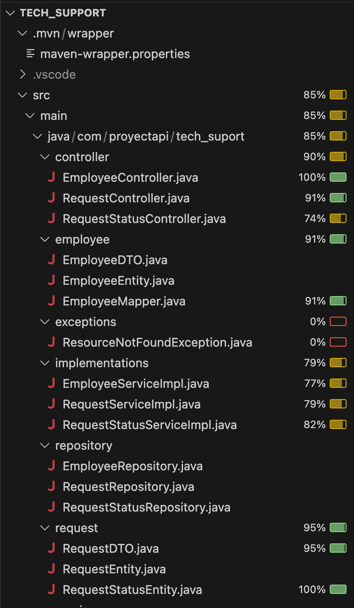

 # Support App - Helpdesk Software


### Situación:

Una startup nos ha solicitado la construcción de una API para que sea consumida por su aplicación web así como su app mobil. La API deberá ser capaz de registrar las solicitudes de los empleados para que puedan solicitar un soporte técnico a su departamento informático en caso de necesidad. No será necesario identificar mediante un módulo de seguridad a los usuarios.

### Requisitos:

- La solicitud contendrá los siguientes datos: nombre del solicitante, fecha de la solicitud, tema de la consulta, descripción
- El Frontend necesitará solicitar la lista de los temas de consulta seleccionable (lista preestablecida en base de datos)
- El departamento técnico debe poder solicitar todas la solicitudes en orden de creación (ASC)
- El departamento técnico debe saber si una solicitud está pendiente de asistencia
- El departamento técnico debe poder marcar una solicitud como atendida y quién la atendió (Con el nombre es suficiente) 
- El departamento técnico debe poder saber cuando se efectuó la asistencia
- El departamento técnico debe poder editar una solicitud ya registrada
- Si una solicitud es editada se deberá saber la fecha y la hora de la edición
- El departamento técnico debe poder eliminar una solicitud, siempre y cuando esta haya sido marcada previamente como atendida
- Cobertura de tests unitarios del 70%


## Proyecto Jira

https://paulaapse.atlassian.net/jira/software/projects/AS/boards/199?atlOrigin=eyJpIjoiN2ZiYWExYTcxY2UwNDY1ZDgxYWY5YjY4YzIwMzFlYTgiLCJwIjoiaiJ9


##  Diagrama

```mermaid
erDiagram
    EMPLEADO {
        int id_empleado PK
        varchar nombre_empleado
        varchar correo
        varchar departamento
    }

    DEPARTAMENTO_TECNICO {
        int id_departamento PK
        varchar nombre_departamento
    }

    TECNICO {
        int id_tecnico PK
        varchar nombre_tecnico
        int id_departamento FK
    }

    TEMA_CONSULTA {
        int id_tema PK
        varchar nombre_tema
    }

    ESTADO_SOLICITUD {
        int id_estado PK
        varchar nombre_estado
    }

    SOLICITUD {
        int id_solicitud PK
        int id_empleado FK
        int id_tema FK
        int id_estado FK
        int id_departamento FK
        int id_tecnico FK
        varchar descripcion_problema
        datetime fecha_creacion
        datetime fecha_asignacion
        datetime fecha_solucion
        datetime fecha_ultima_edicion
        varchar atendido_por
    }

    SOLICITUD }o--|| EMPLEADO : "realizada por"
    SOLICITUD }o--|| TEMA_CONSULTA : "tiene tema"
    SOLICITUD }o--|| ESTADO_SOLICITUD : "tiene estado"
    SOLICITUD }o--|| DEPARTAMENTO_TECNICO : "dirigida a"
    SOLICITUD }o--|| TECNICO : "atendida por"
    TECNICO }o--|| DEPARTAMENTO_TECNICO : "pertenece a"

    ```

## Test de cobertura

